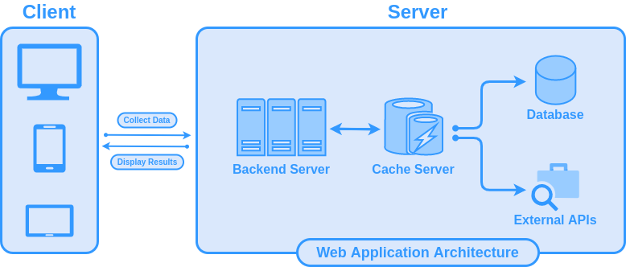

# Branding
This repository contains branding assets for the Find a Clip website.

  
Preview branding assets

  
  - [Logos](./logo/original) (and [favicons](./logo/favicon)) starting from sizes of 64x64 to 512x512.

    
    
    

  - [Banners](./banner) of sizes up to 1024.

    

  - [Diagrams](./diagrams) in svg, png and html formats.

    

 
## License

Distributed under the MIT License. See [LICENSE](./LICENSE) for more
information.
